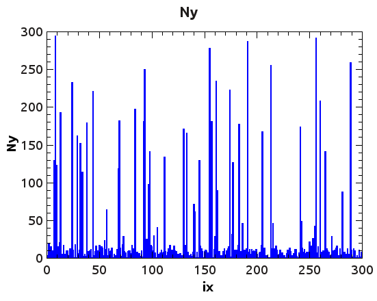
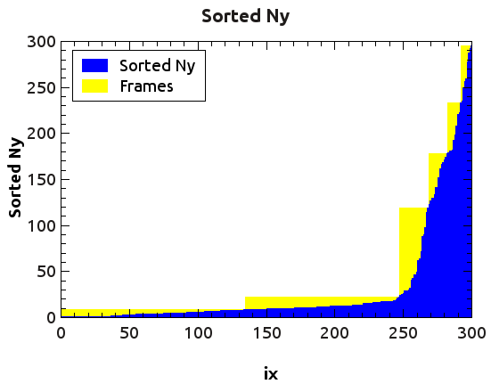

CudaNestedLoop
==============

This code uses CUDA to parallelize nested loops of the type:

'
for(int ix=0; ix<Nx; ix++) {
  for(int iy=0; iy<Ny[ix]; iy++) {
    NestedLoopFunction(ix, iy, ...);
	       ...
'

where 'Ny[]' is an array in CUDA global memory.
In order to use it:
1) Install cub from https://nvlabs.github.io/cub/
2) Add to your code the files nested_loop.cu, nested_loop.h, Ny_th.h,
   cuda_error.h
3) Put the body of the nested loop in a __device__ function
   (NestedLoopFunction in this example) and modify as you need the call to
   this function in nested_loop.cu
4) At the beginning of your program call
   NestedLoop::Init();
5) Run the nested loop with the command:
   NestedLoop::Run(Nx, d_Ny);
   where d_Ny is the array Ny[ix] stored in CUDA global memory 

See the example in the file example.cu

Introduction
------------

A common approach to parallelize a nested loops with two indexes is to use a
CUDA kernel with threads arranged in a two-dimensional grid of size
Nx*max(Ny) indexed by ix and iy

__global__ void SimpleNestedLoopKernel(int Nx, int *Ny)
{
  int ix = (blockIdx.x * blockDim.x) + threadIdx.x;
  int iy = (blockIdx.y * blockDim.y) + threadIdx.y;
  if (ix<Nx && iy<Ny[ix]) {
    NestedLoopFunction(ix, iy, ...);
  }
}

The host code could be a function like the following one:

int SimpleNestedLoop(int Nx, int *d_Ny, int max_Ny)
{
  dim3 threadsPerBlock(block_dim_x_, block_dim_y_);  // block size
  dim3 numBlocks((Nx - 1)/threadsPerBlock.x + 1,
      	     (max_Ny - 1)/threadsPerBlock.y + 1);
  SimpleNestedLoopKernel <<<numBlocks,threadsPerBlock>>>(Nx, d_Ny);
  cudaDeviceSynchronize();

  return 0;
}

where d_Ny is the array Ny[ix] stored in CUDA global memory and max_Ny
is its maximum value.
This simple approach is inefficient for large values of Nx and Ny
and for nonuniform values of Ny[ix], in particular when
the maximum value of Ny is much larger than its average value.
Consider, for instance, the case represented in Fig. 1.
The blue area in this plot represents nodes of the CUDA grid that satisfy
the condition (ix<Nx && iy<Ny[ix]) used in the CUDA kernel above, while
the white area represents nodes that do not satisfy such condition.
Since the kernel launches a thread for each node of the grid, it can be
observed that most threads will end up without executing the body of the
nested loop. Indeed, the computational cost of the above kernel is
O[Nx*max(Ny)/Ncores], while one would expect a good parallel implementation
of the nested loop to have a computational cost of O[Nx*average(Ny)/Ncores],
which in the case of Fig. 1 is much smaller than that of the SimpleNestedLoop
kernel.

Method
------

For large values of Nx and Ny (10000 or more) and for nonuniform values of Ny,
a more efficient solution can be based on sorting the values of Ny and
circumscribing the plot of Ny (sorted) using rectangular frames of fixed area,
from left to right, as shown in Fig. 2.
The code in nested_loop.cu implements a combination of the simple nested loop and of the framed nested loop, which is efficient in all condition. In many
cases this solution is three-four times faster than the simple nested loop
kernel described above.

