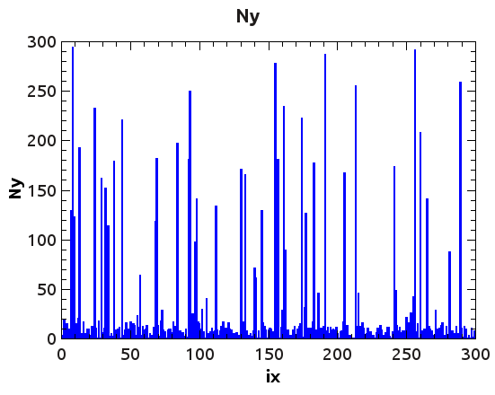
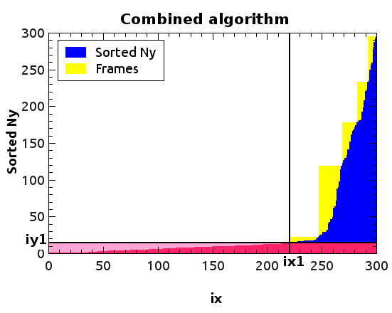
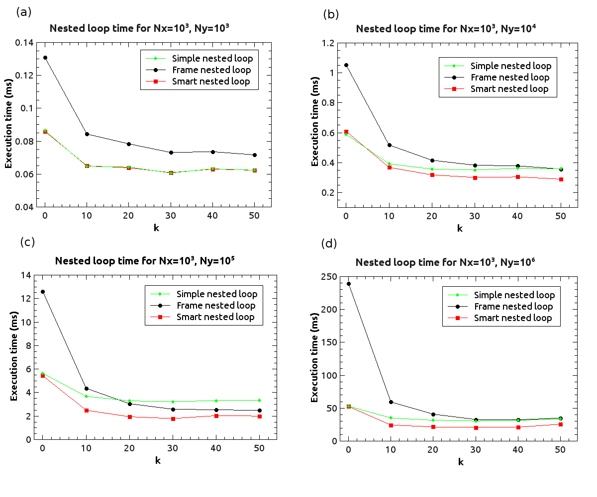
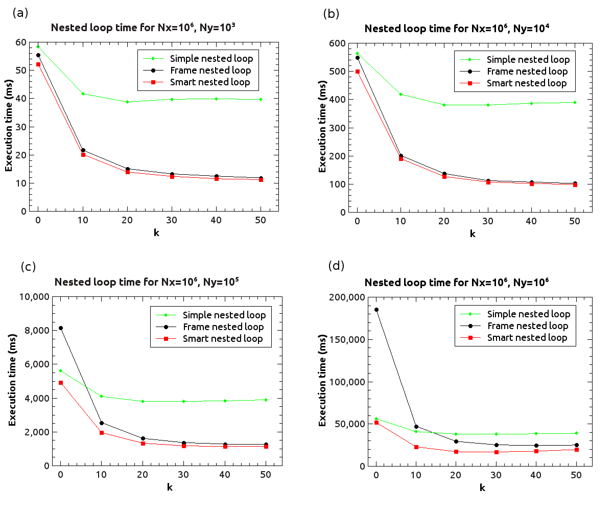

CudaNestedLoop
==============

This code uses CUDA to parallelize nested loops of the type:

```
for(int ix=0; ix<Nx; ix++) {
  for(int iy=0; iy<Ny[ix]; iy++) {
    NestedLoopFunction(ix, iy, ...);
	       ...
```

where Ny[] is an array in CUDA global memory.
In order to use it:

1) Install cub from https://nvlabs.github.io/cub/

2) Add to your code the files nested_loop.cu, nested_loop.h, Ny_th.h,
   cuda_error.h

3) Put the body of the nested loop in a __device__ function
   (NestedLoopFunction in this example) and modify as you need the call to
   this function in nested_loop.cu

4) At the beginning of your program call
   NestedLoop::Init();

5) Run the nested loop with the command:
   NestedLoop::Run(Nx, d_Ny);
   where d_Ny is the array Ny[ix] stored in CUDA global memory 

See the example in the file example.cu

Introduction
------------

A common approach to parallelize a nested loops with two indexes is to use a
CUDA kernel with threads arranged in a two-dimensional grid of size
Nx*max(Ny) indexed by ix and iy

```
__global__ void SimpleNestedLoopKernel(int Nx, int *Ny)
{
  int ix = (blockIdx.x * blockDim.x) + threadIdx.x;
  int iy = (blockIdx.y * blockDim.y) + threadIdx.y;
  if (ix<Nx && iy<Ny[ix]) {
    NestedLoopFunction(ix, iy, ...);
  }
}
```

The host code could be a function like the following one:

```
int SimpleNestedLoop(int Nx, int *d_Ny, int max_Ny)
{
  dim3 threadsPerBlock(block_dim_x_, block_dim_y_);  // block size
  dim3 numBlocks((Nx - 1)/threadsPerBlock.x + 1,
      	     (max_Ny - 1)/threadsPerBlock.y + 1);
  SimpleNestedLoopKernel <<<numBlocks,threadsPerBlock>>>(Nx, d_Ny);
  cudaDeviceSynchronize();

  return 0;
}
```

where d_Ny is the array Ny[ix] stored in CUDA global memory and max_Ny
is its maximum value.
This simple approach is inefficient for large values of Nx and Ny
and for nonuniform values of Ny[ix], in particular when
the maximum value of Ny is much larger than its average value.
Consider, for instance, the case represented in Fig. 1.
The blue area in this plot represents nodes of the CUDA grid that satisfy
the condition ```(ix<Nx && iy<Ny[ix])``` used in the CUDA kernel above, while
the white area represents nodes that do not satisfy such condition.
Since the kernel launches a thread for each node of the grid, it can be
observed that most threads will end up without executing the body of the
nested loop.
The total number of nodes of the grid is


while the number of nodes that satisfy the above condition is


therefore the computational cost of the above kernel is


where C0 is the computational cost for finding max(Ny), C1 is the computational
cost of the threads that do not satisfy the condition for alunching the
nested loop function, and C2 is the computational cost of the threads that
execute the nested loop function.
On the other hand, an ideal parallel implementation of the nested loop
should have a computational cost of


Apart from the term C0, if C1 is not negligible compared to C2 and if max(Ny)
is much larger than mean(Ny), then the computational cost of the
SimpleNestedLoop algorithm can be significantly larger than that of
an ideal nested loop algorithm.


Figure 1

Method
------

For large values of Nx and Ny (10000 or more) and for nonuniform values of Ny,
a more efficient solution can be based on sorting the values of Ny and
circumscribing the plot of Ny (sorted) using rectangular frames of fixed area,
from left to right, as shown in Fig. 2.


Figure 2

The frame nested loop algorithm is the following

```
  // sort the pairs (ix, Ny) with ix=0,..,Nx-1 in ascending order of Ny.
  // After the sorting operation, sorted_idx are the reordered indexes ix
  // and sorted_Ny are the sorted values of Ny 
  Sort(Ny, sorted_Ny, sorted_idx, Nx);
 
  ix0 = Nx;	      // proceeds from right to left
  while(ix0>0) {
    dim_y = sorted_Ny[ix0-1];  // height of the rectangular frame
    // frame_area is the fixed value of the the rectangular frame area
    dim_x = (frame_area - 1) / dim_y + 1; // width of the rectangular frame
    ix0 = ix0 - dim_x; // update the index value
    if (ix0<0) {
      dim_x = dim_x + ix0; // adjust the width if ix0<0 
      ix0 = 0;
    }
    // use a simple nested loop kernel algorithm on the rectangular frame
    FrameNestedLoopKernel(ix0, dim_x, dim_y, sorted_idx, sorted_Ny);
  }
 ```

whith the following CUDA kernel:

```
__global__ void Frame2DNestedLoopKernel(int ix0, int dim_x, int dim_y,
					int *sorted_idx, int *sorted_Ny)
{
  int ix = (blockIdx.x * blockDim.x) + threadIdx.x;
  int iy = (blockIdx.y * blockDim.y) + threadIdx.y;
  if (ix<dim_x && iy<sorted_Ny[ix+ix0]) {
    // call the nested loop function
    NestedLoopFunction(sorted_idx[ix+ix0], iy, ...);
  }
}
```

If the frame area is sufficiently small, the sum of the rectangular frame areas
 will be approximately equal to the sum of Ny, therefore the computational
cost of the frame nested loop algorith will be


where C3 is the cost of the sorting algorithm and C4 is the cost of each
thread that executes the nested loop function.
It should be noted that here the first argument of the nested loop function 
must be retrieved using the sorted index array sort_idx. In CUDA access to global memory is more efficient when it is aligned as in SimpleNestedLoopKernel.
The indirect access used in the frame nested loop algorithm is less efficient.
For this reason, C4 is larger than the factor C2 that appears in the
computational cost of the simple nested loop algorithm.
The computational cost of the sorting algorithm C3 is O(Nx). Therefore,
the frame nested loop algorithm is more efficient than the simple nested
loop algorithm described previously only for large values of max(Ny)
(so that C3 is small compared to the total cost) and if max(Ny)>>mean(Ny).
An algorithm that is efficient in a wider range of conditions is based 
on a combination of the simple nested loop and of the frame nested loop.
Let ix1=alpha*Nx, where 0.5<alpha<1, and iy1=sorted_Ny[ix1];
The horizontal line and the vertical line that pass through the point (ix1,iy1)
divide the plot of sorted_Ny in four rectangular regions, as shown in Fig. 3.
The simple nested loop algorithm is applied on the two regions below the
horizontal line, highlighted in red in Fig. 3. Since those regions cover
the whole range of ix from 0 to Nx-1, the algorithm can be applied on the
unsorted values of ix and Ny.
The frame nested loop algorithm is applied to the upper-right rectangular
region.
Compared to the simple nested loop algorithm, this combined algorithm
has the overhad C3 associated to the sorting operation.
In order to further improve the combined algorithm, it should check at the
beginning if max(Ny) is larger then some threshold, and decide whether
it is more convenient to execute the simple nested loop algorithm or the
combined algorithm. The resulting smart nested loop algorithm
is the following:

```
  if (max_Ny < Ny_th) { // compare max(Ny) with an optimized threshold Ny_th
    SimpleNestedLoop(Nx, Ny); // if it is smaller execute the
                              // simple nested loop algorithm
  }
  else {                      // otherwise execute the combined algorithm
    CombinedNestedLoop(Nx, Ny);
  }
```


Figure 3

Results
-------

The nested loop algorithms have been tested using values of Nx and
Ny_max = max(Ny) in a range from 10 to 10 million.
The elements of the array Ny[ix] have been extracted randomly through the
distribution Ny_max*f(x), where:


x is a random number from a uniform distribution in the range
[0,1), epsilon is a small number (we used epsilon=0.01 in this work) ensuring
that the right part of the distribution is larger than a minimum
probability density, C is a normalization factor


and k is a parameter that quantifies how much f(x) differs from a uniform
distribution: in particular, for k = 0 the distribution is uniform; for
k >> 1 and epsilon << 1/k


The nested loop function used for the tests was a function that simply sums
the values of iy multiplied by a constant

```
__device__ void NestedLoopFunction(int ix, int iy, int val)
{
  atomicAdd(&TestArray[ix], iy*val);
}
```

the atomic operation ensures that the sum is performed without interference
among parallel threads.

The simple nested loop algorithm has no free parameters. The frame nested loop
algorithm has only one free parameter, i.e. the frame area.
The free parameters of the combined algorithm are the frame area, the factor
alpha of Eq. xxx, and the threshold Ny_th.
The criterion for optimizing those parameters was based on the average
relative execution time


where, for each value of Nx, Ny_max and k, tcomb is the execution time of the
combined algorithm and tbest is the minimum execution time
between the simple nested loop algorithm and the frame nested loop algorithm.
Since Nx and Ny_max can vary by several order of magnitudes  and the
algorithm should perform well on all scales, the values of Nx and Ny_max used
for computing the average have been sampled uniformy on a logarithmic scale,
from about 10 to about 10 million, as shown in Fig. xxx.
On the other hand. the values of k have been uniformly sampled on a linear
scale in the range from 0 to 100.
Fig. xxx represents the value of tau as a function of the frame area (Fig. xxx a) and as a function of the coefficient alpha (Fig. xxx b).
The values of Ny_th have been optimized by comparing the execution time
of the simple nested loop algorithm with that of the combined algorithm
on each node of the grid represented in Fig. xxx.
For each value of Nx, the threshold is the value of Ny_max above which the
combined algorithm has an execution time lower than that of the simple nested
loop algorithm.

Figure 4 shows the execution time of the three nestes loop algorithms as a
function of k for Nx = 1000 and Ny_max = 1000 (Fig. 4a), 10000 (Fig. 4b),
100000 (Fig. 4c) and 1 million (Fig. 4d).


Figure 4

Figure 5 shows the execution time of the three nestes loop algorithms as a
function of k for Nx = 1 million and Ny_max = 1000 (Fig. 5a), 10000 (Fig. 5b),
100000 (Fig. 5c) and 1 million (Fig. 5d).


Figure 5

It can be observed that the frame nested loop algorithm is faster than the
simple nested loop algorithm for large value of the area Nx*Ny_max and for
large values of k. The performance of the smart nested loop algorithms is
always better or equal to that of the other two algorithms.
